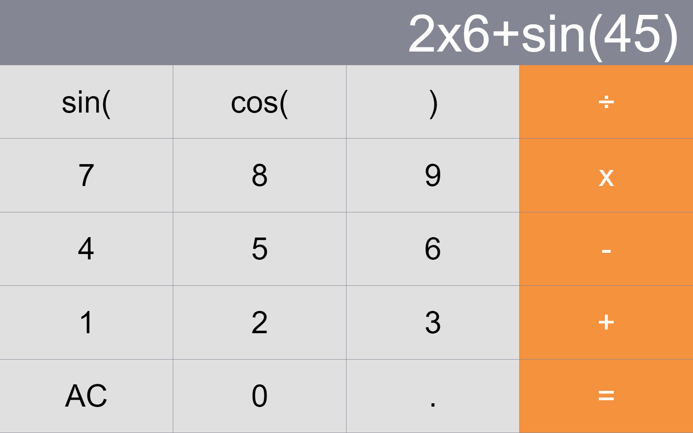
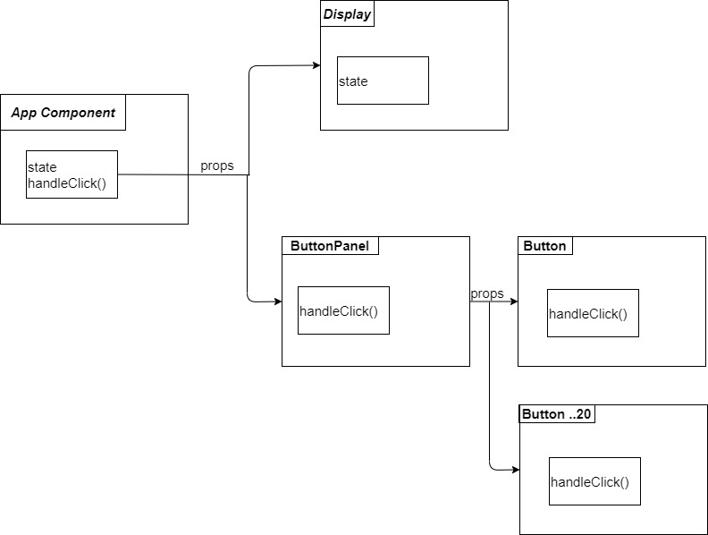
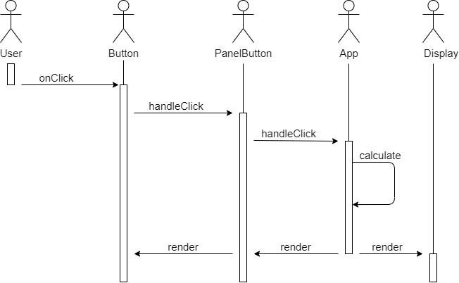

# Calculator programming in ReactJS

`This project is developed by Huy Le. The references are mentioned in the Reference category`



## Structure Components

<br>



## Expression Parsing with Stack

### Infix to Postfix transformation 


When we meet the `'+' or '-'` operators
```javascript
        if (char === "+" || char === "-") {
            postfix.push(number);
            number = "";
            let indexPop =
                stack.indexOf('sin') >= 0 ? stack.indexOf('sin') + 1 :
                stack.indexOf('cos') >= 0 ? stack.indexOf('cos') + 1 :
                stack.indexOf('+') >= 0 ? stack.indexOf('+') :
                stack.indexOf('-') >= 0 ? stack.indexOf('-') : 
                stack.indexOf('x') >= 0 ? stack.indexOf('x') :
                stack.indexOf('÷') >= 0 ? stack.indexOf('÷') :stack.length;

            for (let i = stack.length; i > indexPop; i--) {
                postfix.push(stack.pop());
            }
            stack.push(char);
        }
```

When we meet the `'x' or '÷'` operators
```javascript
        else if (char === "x" || char === "÷") {
                    postfix.push(number);
                    number = "";
                    stack.push(char);
        }
```

When we meet the `'sin' or 'cos' ` operators
```javascript
        else if (char === "s" || char === "c") {
                index += 3;
                number = "";
                stack.push(char === "s" ? "sin" : "cos");
                openIndex = stack.length - 1;
        }
```

When we meet the `'(' or ')'` operators
```javascript
        else if (char === "(" || char === ")") {
            if (char === "(") {
                stack.push("(");
                openIndex = stack.length - 1;
            } else {
                postfix.push(number);
                number = "";
                for (let i = stack.length; i > openIndex; i--) {
                    postfix.push(stack[i] === "(" ? "" : stack.pop());
                }
            }
        }
```

When we meet the `number`
```javascript
        else {
            number += char;
        }
```

### Process function


```javascript
function computePostfix(expression) {
    let stack = [];
    for (let element of expression) {
        if (isNaN(element)) {
            switch (element) {
                case '+':
                    stack.push(stack.pop() + stack.pop());
                    break;
                case '-':
                    stack.push(-stack.pop() + stack.pop());
                    break;
                case 'x':
                    stack.push(stack.pop() * stack.pop());
                    break;
                case '÷':
                    stack.push(1/stack.pop() * stack.pop());
                    break;
                case 'sin':
                    stack.push(Math.sin(stack.pop()));
                    break;
                case 'cos':
                    stack.push(Math.cos(stack.pop()));
                    break;
                default:
                    break;
            }
        } else {
            stack.push(Number(element));
        }
    }
    return stack[0];
}
```
## References
[1] A. H. Farmer, "Calculator," ht<span>tps://github.com/ahfarmer/calculator</span>, 03-Jun-2019. [Online]. Available: ht<span>tps://github.com</span> [Accessed: 27-Sep-2022]. 

[2] Richard F. Gilberg, Behrouz A. Forouzan, "Data Structures - A Pseudocode Approach with C," in <i> Stack Applications</i>. Course Technology, 2005, pp. 102-134.
